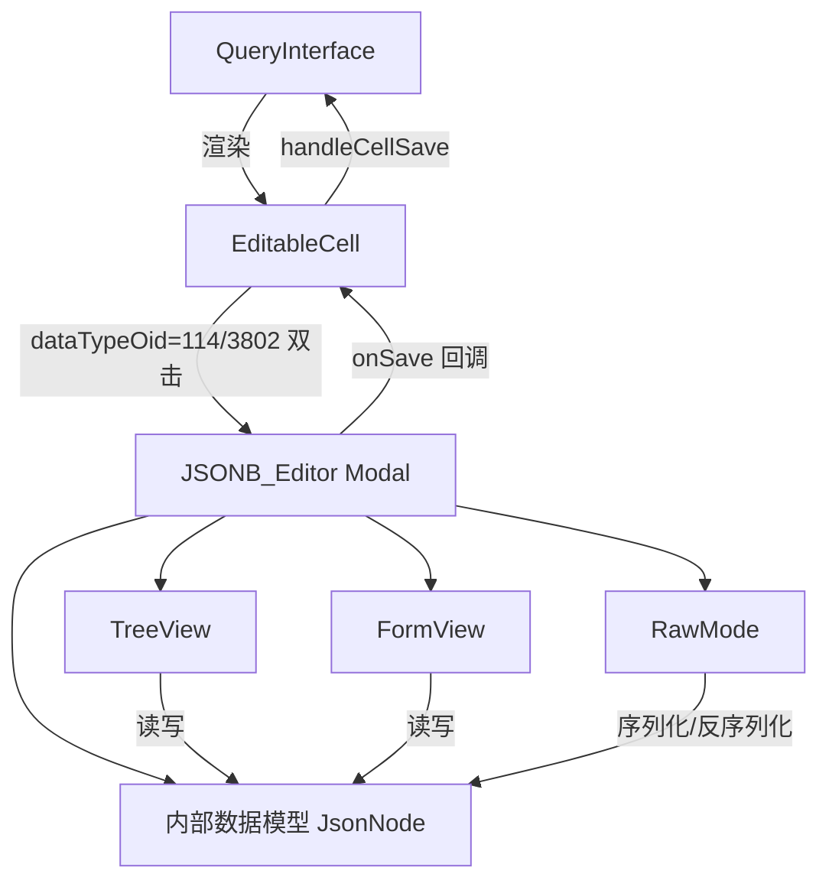

# 设计文档：JSONB 编辑器

## 概述

JSONB 编辑器（`JSONB_Editor`）是一个 SolidJS 弹窗组件，为 `QueryInterface` 结果表格中的 JSON/JSONB 类型列提供可视化编辑能力。当用户双击 `dataTypeOid` 为 114（json）或 3802（jsonb）的单元格时，弹窗替代原有的 `<input>` 内联编辑，提供树形视图、表单视图和原始文本三种编辑模式。

编辑完成后，`JSONB_Editor` 通过 `EditableCell` 的 `onSave` 回调将紧凑 JSON 字符串写回，与现有的 `pendingUpdates` 队列和 `saveAllChanges` 流程完全兼容，无需修改 `QueryInterface` 的保存逻辑。

---

## 架构



### 数据流

1. `EditableCell` 检测 `dataTypeOid`，双击时若为 JSON/JSONB 则打开 `JSONB_Editor` 而非 `<input>`
2. `JSONB_Editor` 将原始字符串解析为内部 `JsonNode` 树
3. 三种视图共享同一 `JsonNode` 信号，切换时同步
4. 点击"确认"时将 `JsonNode` 序列化为紧凑 JSON 字符串，调用 `onSave`
5. `QueryInterface.handleCellSave` 接收新值，生成 UPDATE SQL 并加入 `pendingUpdates`

---

## 组件设计

### JSONB_Editor

**文件：** `solid-project/frontend/jsonb-editor.tsx`

主弹窗组件，负责状态管理和视图协调。

```typescript
interface JsonbEditorProps {
  /** 初始 JSON 字符串（null 表示 SQL NULL） */
  initialValue: string | null;
  /** 是否只读 */
  isReadOnly: boolean;
  /** 保存回调，传入紧凑 JSON 字符串或 null */
  onSave: (value: string | null) => void;
  /** 关闭弹窗回调 */
  onClose: () => void;
}
```

内部状态：

| 信号 | 类型 | 说明 |
|------|------|------|
| `mode` | `"tree" \| "form" \| "raw"` | 当前视图模式，默认 `"tree"` |
| `rootNode` | `JsonNode` | 内部数据模型根节点 |
| `rawText` | `string` | Raw 模式的文本内容 |
| `rawError` | `string \| null` | Raw 模式的验证错误 |

模式切换逻辑：
- 切换到 Raw：将 `rootNode` 序列化为 `JSON.stringify(value, null, 2)`
- 从 Raw 切换：先 `JSON.parse(rawText)`，失败则阻止切换并显示错误

---

### TreeView

**文件：** `solid-project/frontend/jsonb-editor.tsx`（内部组件）

递归渲染 `JsonNode` 树，支持展开/折叠、内联编辑、添加/删除节点。

```typescript
interface TreeViewProps {
  node: JsonNode;
  path: (string | number)[];
  depth: number;
  isReadOnly: boolean;
  onUpdate: (path: (string | number)[], newValue: JsonValue) => void;
  onDelete: (path: (string | number)[]) => void;
  onAddChild: (path: (string | number)[], type: "object" | "array") => void;
}
```

展开规则：深度 ≤ 3 默认展开，深度 > 3 默认折叠。

右键菜单：
- "复制路径"：生成 PostgreSQL JSONB 路径（`data->'key'->>'leaf'`）
- "复制值"：将节点 JSON 值写入剪贴板

---

### FormView

**文件：** `solid-project/frontend/jsonb-editor.tsx`（内部组件）

仅支持 JSON 对象根值，将顶层键值对渲染为表单行。

```typescript
interface FormViewProps {
  rootNode: JsonNode;
  isReadOnly: boolean;
  onUpdate: (key: string, newValue: JsonValue) => void;
  onRenameKey: (oldKey: string, newKey: string) => void;
  onDeleteKey: (key: string) => void;
  onAddKey: () => void;
}
```

值解析优先级（`parseFormValue`）：
1. `"null"` → `null`
2. `"true"` / `"false"` → `boolean`
3. 合法数字字符串 → `number`
4. 合法 JSON 对象/数组字符串 → 解析后的值
5. 其他 → `string`

---

### RawMode

**文件：** `solid-project/frontend/jsonb-editor.tsx`（内部组件）

多行 `<textarea>`，实时验证 JSON 合法性。

```typescript
interface RawModeProps {
  text: string;
  error: string | null;
  isReadOnly: boolean;
  onChange: (text: string) => void;
  onFormat: () => void;
}
```

---

## 数据模型

### JsonNode 类型

内部使用统一的 `JsonNode` 类型表示 JSON 树，避免直接操作原始 `any` 值：

```typescript
type JsonPrimitive = string | number | boolean | null;

type JsonValue = JsonPrimitive | JsonObject | JsonArray;

interface JsonObject {
  type: "object";
  entries: Array<{ key: string; value: JsonNode }>;
}

interface JsonArray {
  type: "array";
  items: JsonNode[];
}

interface JsonLeaf {
  type: "string" | "number" | "boolean" | "null";
  value: JsonPrimitive;
}

type JsonNode = JsonObject | JsonArray | JsonLeaf;
```

### 核心工具函数

```typescript
/** 将原始 JS 值转换为 JsonNode */
function toJsonNode(value: unknown): JsonNode

/** 将 JsonNode 还原为原始 JS 值 */
function fromJsonNode(node: JsonNode): JsonValue

/** 序列化为紧凑 JSON 字符串（用于 onSave） */
function serializeCompact(node: JsonNode): string

/** 序列化为格式化 JSON 字符串（用于 Raw 模式显示） */
function serializePretty(node: JsonNode): string

/** 安全解析 JSON 字符串，返回 { ok, node } 或 { ok: false, error } */
function parseJsonSafe(str: string): { ok: true; node: JsonNode } | { ok: false; error: string }

/** 不可变更新：在指定路径设置新值，返回新的根节点 */
function updateAtPath(root: JsonNode, path: (string | number)[], newValue: JsonValue): JsonNode

/** 不可变删除：移除指定路径的节点 */
function deleteAtPath(root: JsonNode, path: (string | number)[]): JsonNode

/** 构建 PostgreSQL JSONB 路径字符串 */
function buildJsonPath(columnName: string, path: (string | number)[], isLeaf: boolean): string

/** 解析表单值输入字符串为 JsonValue */
function parseFormValue(input: string): JsonValue

/** 判断两个 JsonNode 是否语义等价 */
function jsonNodesEqual(a: JsonNode, b: JsonNode): boolean
```

---

## 与现有组件的集成方案

### EditableCell 修改

在 `editable-cell.tsx` 中，`startEditing()` 函数需要根据 `dataTypeOid` 分支：

```typescript
// 新增：JSON/JSONB OID 常量
const JSON_OIDS = new Set([114, 3802]);

function startEditing() {
  if (!props.isEditable) {
    // 只读 JSON 单元格也可以打开查看
    if (JSON_OIDS.has(props.dataTypeOid ?? 0)) {
      setShowJsonEditor(true);
    }
    return;
  }
  if (JSON_OIDS.has(props.dataTypeOid ?? 0)) {
    setShowJsonEditor(true);  // 打开 JSONB_Editor 弹窗
    return;
  }
  // 原有逻辑
  setEditValue(formatCellToEditable(getValue(), props.dataTypeOid));
  setIsEditing(true);
}
```

新增信号：
- `showJsonEditor: boolean` — 控制 `JSONB_Editor` 弹窗显示

`EditableCell` 渲染中追加：

```tsx
<Show when={showJsonEditor()}>
  <JsonbEditor
    initialValue={getValue()}
    isReadOnly={!props.isEditable}
    onSave={(v) => { props.onSave?.(v); setShowJsonEditor(false); }}
    onClose={() => setShowJsonEditor(false)}
  />
</Show>
```

### QueryInterface 集成

`QueryInterface` 无需修改核心逻辑：
- `handleCellSave` 已处理 `string | null` 类型的新值
- `generateUpdateSql` 调用 `formatSqlValueShared(newValue, colInfo.dataTypeOid)`

需确认 `formatSqlValueShared` 对 `dataTypeOid=3802` 的处理：输出应为 `'...'::jsonb`。若当前实现未处理，需在 `shared/src/sql-format.ts` 中补充 JSONB 类型转换。

### SQL 格式化（formatSqlValue）

对 `dataTypeOid` 为 3802（jsonb）或 114（json）的值，`formatSqlValueShared` 应输出：

```sql
'{"key":"value"}'::jsonb
```

---

## 正确性属性

*属性（Property）是在系统所有合法执行中都应成立的特征或行为——本质上是对系统应做什么的形式化陈述。属性是人类可读规范与机器可验证正确性保证之间的桥梁。*

### Property 1：JSON 解析往返一致性

*对任意* 合法 JSON 字符串 `s`，`serializeCompact(parseJsonSafe(s).node)` 解析后应与 `JSON.parse(s)` 语义等价（即 `JSON.parse(serializeCompact(parseJsonSafe(s).node))` 深度等于 `JSON.parse(s)`）。

**Validates: Requirements 10.4, 7.2**

---

### Property 2：非法 JSON 被拒绝

*对任意* 不能被 `JSON.parse` 解析的字符串，`parseJsonSafe` 应返回 `{ ok: false, error: string }`，且 `error` 字段非空。

**Validates: Requirements 1.4, 4.2, 4.3, 7.4, 8.3**

---

### Property 3：节点数量与 JSON 结构一致

*对任意* JSON 对象，`toJsonNode` 转换后 `JsonObject.entries` 的长度应等于原对象的键数；*对任意* JSON 数组，`JsonArray.items` 的长度应等于原数组的长度。

**Validates: Requirements 2.1, 2.2**

---

### Property 4：节点可展开性与类型对应

*对任意* `JsonNode`，当且仅当其 `type` 为 `"object"` 或 `"array"` 时，`isExpandable(node)` 返回 `true`；叶子节点（`string`、`number`、`boolean`、`null`）返回 `false`。

**Validates: Requirements 2.3**

---

### Property 5：深度超过 3 层时默认折叠

*对任意* `JsonNode` 和深度值 `depth`，`getInitialExpanded(node, depth)` 当 `depth > 3` 时返回 `false`，当 `depth <= 3` 且节点为对象或数组时返回 `true`。

**Validates: Requirements 2.5**

---

### Property 6：值类型颜色唯一映射

*对任意* 两种不同的 JSON 值类型（`string`、`number`、`boolean`、`null`、`object`/`array`），`getValueColor(typeA)` 与 `getValueColor(typeB)` 应返回不同的颜色字符串。

**Validates: Requirements 2.4**

---

### Property 7：表单视图行数与顶层键数一致

*对任意* JSON 对象根值，`FormView` 渲染的行数应等于该对象的顶层键数。

**Validates: Requirements 3.1**

---

### Property 8：键名更新保留值

*对任意* JSON 对象模型、旧键名 `oldKey` 和新键名 `newKey`，执行 `renameKey(model, oldKey, newKey)` 后：新键存在、旧键不存在、对应值不变、其他键值对不受影响。

**Validates: Requirements 3.5**

---

### Property 9：表单值解析类型正确

*对任意* 输入字符串，`parseFormValue` 应满足：
- `"null"` → `null`
- `"true"` / `"false"` → `boolean`
- 合法数字字符串 → `number`
- 其他字符串 → `string`（不抛出异常）

**Validates: Requirements 3.6**

---

### Property 10：Raw 模式序列化格式

*对任意* 合法 `JsonNode`，`serializePretty(node)` 的输出应等于 `JSON.stringify(fromJsonNode(node), null, 2)`。

**Validates: Requirements 4.1, 5.3**

---

### Property 11：紧凑序列化往返

*对任意* 合法 `JsonNode`，`serializeCompact(node)` 的输出应等于 `JSON.stringify(fromJsonNode(node))`，且 `parseJsonSafe(serializeCompact(node)).node` 与原节点语义等价。

**Validates: Requirements 7.2**

---

### Property 12：未变化时 hasChanged 返回 false

*对任意* 合法 JSON 字符串 `s`，将其解析为 `JsonNode` 后再序列化，`jsonNodesEqual(parseJsonSafe(s).node, parseJsonSafe(serializeCompact(parseJsonSafe(s).node)).node)` 应返回 `true`。

**Validates: Requirements 7.5**

---

### Property 13：JSONB SQL 格式化包含类型转换

*对任意* 合法 JSON 字符串 `s`，`formatSqlValue(s, 3802)` 的输出应包含 `::jsonb` 后缀，且输出中的 JSON 字符串部分与 `s` 语义等价。

**Validates: Requirements 10.3**

---

### Property 14：PostgreSQL JSONB 路径构建正确性

*对任意* 路径段数组 `path`（字符串或数字），`buildJsonPath(columnName, path, isLeaf)` 应满足：
- 非叶子节点使用 `->` 操作符
- 叶子节点使用 `->>` 操作符
- 数字索引使用 `->` 加数字（如 `->0`）
- 路径段数等于 `path.length + 1`（含列名）

**Validates: Requirements 9.2**

---

## 错误处理

| 场景 | 处理方式 |
|------|----------|
| 单元格值为 SQL NULL | 初始化为空对象 `{}` 的 `JsonNode` |
| 单元格值为非法 JSON 字符串 | 强制进入 Raw 模式，显示解析错误，禁用 Tree/Form 切换 |
| Raw 模式切换时文本非法 | 阻止切换，在模式标签下方显示红色错误提示 |
| 点击"确认"时 Raw 模式非法 | 禁用确认按钮（实时验证），或显示错误提示 |
| 路径更新时路径不存在 | `updateAtPath` 返回原节点，不抛出异常 |
| 极深嵌套（>50 层） | 超过深度限制时停止递归渲染，显示"..."占位符 |

---

## 测试策略

### 双轨测试方法

单元测试和属性测试互补，共同保证正确性：
- **单元测试**：验证具体示例、边界条件和错误路径
- **属性测试**：验证对所有输入都成立的普遍规律

### 单元测试

针对以下具体场景：
- `parseJsonSafe(null)` → 返回空对象节点
- `parseJsonSafe("not json")` → 返回 `{ ok: false, error: "..." }`
- 只读模式打开时 `isReadOnly=true`
- 默认模式为 `"tree"`
- JSON 根值为数组时 FormView 显示提示信息
- 从 Raw 模式切换到 Tree 模式时，非法文本阻止切换

### 属性测试

使用 **fast-check**（TypeScript 属性测试库）实现，每个属性测试最少运行 **100 次**。

每个属性测试用注释标注对应设计属性：

```typescript
// Feature: jsonb-editor, Property 1: JSON 解析往返一致性
it.prop([fc.jsonValue()])(
  "JSON 解析往返一致性",
  (value) => {
    const str = JSON.stringify(value);
    const node = parseJsonSafe(str);
    expect(node.ok).toBe(true);
    if (node.ok) {
      const roundTripped = JSON.parse(serializeCompact(node.node));
      expect(roundTripped).toEqual(value);
    }
  },
  { numRuns: 100 }
);
```

**属性测试覆盖清单：**

| 属性编号 | 测试函数 | fast-check 生成器 |
|----------|----------|-------------------|
| Property 1 | JSON 解析往返 | `fc.jsonValue()` |
| Property 2 | 非法 JSON 被拒绝 | `fc.string()` 过滤合法 JSON |
| Property 3 | 节点数量一致 | `fc.object()`, `fc.array(fc.anything())` |
| Property 4 | 节点可展开性 | `fc.jsonValue()` |
| Property 5 | 深度折叠规则 | `fc.jsonValue()`, `fc.integer({ min: 0, max: 10 })` |
| Property 6 | 颜色唯一映射 | 枚举所有类型组合 |
| Property 7 | 表单行数一致 | `fc.object()` |
| Property 8 | 键名更新保留值 | `fc.object()`, `fc.string()` |
| Property 9 | 表单值解析类型 | `fc.string()` |
| Property 10 | Raw 序列化格式 | `fc.jsonValue()` |
| Property 11 | 紧凑序列化往返 | `fc.jsonValue()` |
| Property 12 | 未变化检测 | `fc.jsonValue()` |
| Property 13 | JSONB SQL 格式化 | `fc.jsonValue()` |
| Property 14 | JSONB 路径构建 | `fc.array(fc.oneof(fc.string(), fc.integer()))` |
