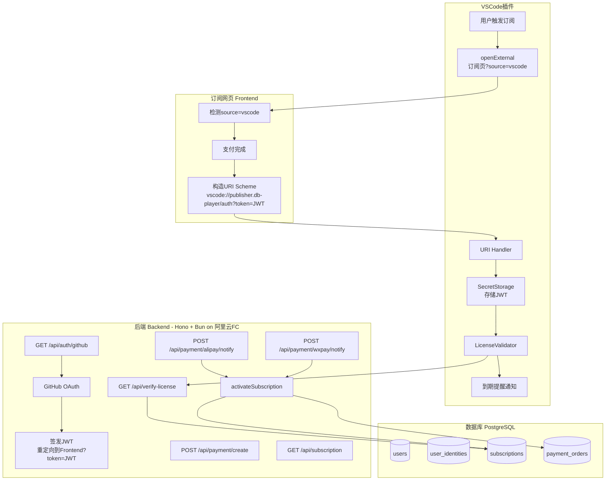

# 设计文档：subscription-module

## 概述

DB Player 订阅模块为 VSCode 插件提供完整的订阅生命周期管理。核心流程分为三条路径：

1. **纯网页订阅**：用户直接访问订阅页，完成 GitHub 登录 → 选择套餐 → 支付 → 激活。
2. **插件触发订阅**：VSCode 插件检测到未订阅时，唤起浏览器打开订阅页（附加 `source=vscode`），支付完成后通过 URI Scheme 将 JWT 回传插件。
3. **插件内校验**：插件启动时通过 `LicenseValidator` 调用 `/api/verify-license` 校验订阅有效性，结果缓存 1 小时，并在到期前 7 天展示提醒通知。

后端已实现 GitHub OAuth、支付宝/微信 Native 支付、订阅激活与校验接口，数据库 schema 无需变更。本次新增内容：后端修改 `source` 参数透传逻辑、前端新增 VSCode 模式检测与 URI Scheme 跳转、VSCode 插件新增 URI Handler / SecretStorage / LicenseValidator 三个组件。

---

## 架构



---

## 组件与接口

### 后端修改：`source` 参数透传

现有 `/api/auth/github/callback` 在重定向到前端时，需将 `source` 参数透传。实现方式：在发起 GitHub OAuth 时，将 `source` 编码进 `state` 参数（JSON 格式），回调时解析 `state` 取出 `source`，拼入重定向 URL。

```
GET /api/auth/github?source=vscode
→ state = base64(JSON.stringify({ nonce: uuid, source: "vscode" }))
→ GitHub OAuth 回调
→ 302 {FRONTEND_URL}?token=<JWT>&source=vscode
```

### 前端新增：VSCode 模式检测

`app.ts` 新增逻辑：

- 初始化时检测 `URLSearchParams` 中的 `source=vscode`，存入 `sessionStorage`。
- 支付成功后（微信轮询到 `paid` / 支付宝 `returnUrl` 回到页面），若 `source=vscode` 且持有有效 JWT，自动执行 URI Scheme 跳转。
- 展示"返回 VSCode"按钮（`source=vscode` 且已登录时可见）。

### VSCode 插件新增组件

#### URI Handler

```typescript
// 注册到 package.json uriHandler
class DbPlayerUriHandler implements vscode.UriHandler {
  handleUri(uri: vscode.Uri): void
}
```

处理路径：`vscode://publisher.db-player/auth`，提取 `token` 参数，验证 JWT 格式后交给 `TokenStorage` 存储。

#### SecretStorage 封装

```typescript
class TokenStorage {
  async getToken(): Promise<string | undefined>
  async setToken(token: string): Promise<void>
  async clearToken(): Promise<void>
}
```

底层使用 `vscode.ExtensionContext.secrets`，key 为 `dbplayer.jwt`。

#### LicenseValidator

```typescript
class LicenseValidator {
  async validate(): Promise<{ valid: boolean; expiresAt: number | null }>
  invalidateCache(): void
}
```

- 缓存结构：`{ result, cachedAt }` 存于内存，有效期 1 小时。
- 无 JWT 时直接返回 `{ valid: false, expiresAt: null }`，不发起请求。
- 请求失败时清除缓存，返回无效状态。

#### 到期提醒

```typescript
class ExpiryNotifier {
  async checkAndNotify(expiresAt: number | null): Promise<void>
}
```

- 距到期 ≤ 7 天时，通过 `vscode.window.showWarningMessage` 展示提醒，含"立即续费"按钮。
- 使用 `Set<number>` 记录已提醒的 `expiresAt`，同一会话内不重复提醒。

---

## 数据模型

数据库 schema 无需变更，复用现有四张表：

| 表 | 关键字段 | 说明 |
|---|---|---|
| `users` | `id`, `email`, `name` | 用户基础信息 |
| `user_identities` | `provider`, `provider_user_id` | GitHub OAuth 身份绑定 |
| `subscriptions` | `user_id`, `plan`, `status`, `expires_at` | 订阅记录，续费时更新同一条记录 |
| `payment_orders` | `order_no`, `status`, `paid_at` | 支付订单，`FOR UPDATE` 保证幂等 |

### JWT Payload

```typescript
interface JwtPayload {
  userId: number;
  email: string;
  iss: "db-player";
  aud: "db-player-api";
  exp: number; // 签发时间 + 7天
}
```

### API 响应类型

```typescript
// GET /api/verify-license
interface VerifyLicenseResponse {
  valid: boolean;
  expiresAt: number | null; // Unix 时间戳（秒），永久订阅为 null
}

// GET /api/subscription
interface SubscriptionResponse {
  success: boolean;
  subscription: {
    active: boolean;
    plan: "free" | "monthly" | "yearly";
    expiresAt: number | null;
  };
}
```

---

## 数据流

### 流程 A：插件触发订阅（完整链路）

```
1. 插件检测到未订阅
2. openExternal({SUBSCRIPTION_URL}?source=vscode)
3. 浏览器打开订阅页，Frontend 检测 source=vscode，存入 sessionStorage
4. 用户点击 GitHub 登录 → GET /api/auth/github?source=vscode
5. 后端将 source 编码进 state，发起 GitHub OAuth
6. 回调：解析 state，重定向到 {FRONTEND_URL}?token=JWT&source=vscode
7. Frontend 存储 JWT，检测到 source=vscode，展示"返回 VSCode"按钮
8. 用户选择套餐并支付（支付宝/微信）
9. 支付成功后，Frontend 构造 vscode://publisher.db-player/auth?token=JWT
10. window.location.href = URI Scheme → 唤起 VSCode
11. URI Handler 提取 token → TokenStorage 存储
12. LicenseValidator 刷新缓存，插件 UI 更新为已订阅状态
```

### 流程 B：插件启动校验

```
1. 插件激活，LicenseValidator.validate() 被调用
2. 检查内存缓存：若有效（< 1小时），直接返回缓存结果
3. 从 TokenStorage 读取 JWT
4. 若无 JWT，返回 { valid: false, expiresAt: null }
5. 携带 JWT 调用 GET /api/verify-license
6. 成功：缓存结果，检查 expiresAt 是否在 7 天内，触发 ExpiryNotifier
7. 失败/401：清除缓存，返回无效状态
```

---

## 接口定义

### 后端接口变更

#### `GET /api/auth/github`（修改）

新增可选查询参数 `source`，将其编码进 OAuth `state`：

```
state = base64(JSON.stringify({ nonce: uuid, source?: string }))
```

#### `GET /api/auth/github/callback`（修改）

解析 `state` 中的 `source`，重定向时附加：

```
302 {FRONTEND_URL}?token=<JWT>[&source=<source>]
```

### 现有接口（无变更）

| 方法 | 路径 | 认证 | 说明 |
|---|---|---|---|
| GET | `/api/health` | 无 | 健康检查 |
| GET | `/api/auth/github` | 无 | 发起 GitHub OAuth |
| GET | `/api/auth/github/callback` | 无 | OAuth 回调，签发 JWT |
| GET | `/api/subscription` | Bearer JWT | 查询订阅状态 |
| POST | `/api/payment/create` | Bearer JWT | 创建支付订单 |
| GET | `/api/payment/order/:orderNo` | Bearer JWT | 查询订单状态 |
| POST | `/api/payment/alipay/notify` | 支付宝签名 | 支付宝异步回调 |
| POST | `/api/payment/wxpay/notify` | 微信签名 | 微信支付异步回调 |
| GET | `/api/verify-license` | Bearer JWT | 校验订阅有效性 |

---

## 正确性属性

*属性（Property）是在系统所有有效执行中都应成立的特征或行为——本质上是对系统应做什么的形式化陈述。属性是人类可读规范与机器可验证正确性保证之间的桥梁。*

### 属性 1：JWT 签发规范

*对于任意*用户 payload（userId, email），签发的 JWT 必须满足：算法为 HS256、issuer 为 `db-player`、audience 为 `db-player-api`、过期时间在签发后 7 天内（允许 ±60 秒误差）。

**验证需求：1.3, 6.2**

### 属性 2：token 存储与 URL 清理

*对于任意*有效 token 字符串，当 URL 中包含 `token` 参数时，调用 `getToken()` 后，localStorage 中应存有该 token，且 URL 中不再包含 `token` 参数。

**验证需求：1.4**

### 属性 3：支付回调验签拒绝

*对于任意*格式错误或签名无效的支付回调请求，系统应拒绝处理并返回失败响应，订阅状态不发生变化。

**验证需求：1.10, 6.5**

### 属性 4：支付激活订阅

*对于任意*有效支付订单，激活后订单状态应变为 `paid`，且对应用户存在状态为 `active` 的订阅记录，`expires_at` 大于当前时间。

**验证需求：1.11**

### 属性 5：续费顺延计算

*对于任意*已有有效订阅的用户，续费后的 `expires_at` 应等于原 `expires_at` 加上套餐天数（秒），而非从当前时间计算。

**验证需求：1.12, 8.3**

### 属性 6：openExternal 附加 source=vscode

*对于任意*插件内触发的订阅或续费操作，调用 `vscode.env.openExternal` 时传入的 URL 必须包含 `source=vscode` 查询参数。

**验证需求：2.2, 5.2**

### 属性 7：source=vscode 时构造 URI Scheme

*对于任意*持有有效 JWT 且 `source=vscode` 的前端状态，支付成功后构造的跳转 URL 必须符合格式 `vscode://publisher.db-player/auth?token=<JWT>`，且 token 值与当前存储的 JWT 完全一致。

**验证需求：2.3, 3.2**

### 属性 8：URI Handler 存储 token

*对于任意*格式合法的 URI `vscode://publisher.db-player/auth?token=<T>`，URI Handler 处理后，`SecretStorage` 中存储的 token 应等于 `T`。

**验证需求：3.3**

### 属性 9：无效 token 被拒绝

*对于任意*格式非法的 token 字符串（非 JWT 格式、签名错误、已过期），URI Handler 处理后，`SecretStorage` 中不应存储该 token，且应触发重新登录提示。

**验证需求：3.4**

### 属性 10：缓存行为

*对于任意*有效的 `/api/verify-license` 响应，在缓存写入后 1 小时内，重复调用 `LicenseValidator.validate()` 不应发起新的网络请求，且返回结果与缓存一致。

**验证需求：4.2, 4.4**

### 属性 11：无效响应清除缓存

*对于任意* `valid: false` 的响应或网络请求失败，`LicenseValidator` 的内存缓存应被清除，后续调用将重新发起网络请求。

**验证需求：4.3**

### 属性 12：无 JWT 时不发起请求

*对于任意* `SecretStorage` 中不存在 JWT 的状态，调用 `LicenseValidator.validate()` 应直接返回 `{ valid: false, expiresAt: null }`，不发起任何网络请求。

**验证需求：4.5**

### 属性 13：受保护接口认证

*对于任意*缺失、格式错误或已过期的 JWT，对受保护接口（`/api/subscription`、`/api/payment/create`、`/api/payment/order/:orderNo`、`/api/verify-license`）的请求应返回 HTTP 401，不执行业务逻辑。

**验证需求：4.6, 6.1, 6.3**

### 属性 14：到期提醒触发

*对于任意* `expiresAt` 距当前时间不足 7 天（且大于 0）的订阅状态，`ExpiryNotifier.checkAndNotify()` 应触发 VSCode 通知，通知内容包含剩余天数和"立即续费"操作按钮。

**验证需求：5.1**

### 属性 15：提醒去重

*对于任意*相同的 `expiresAt` 值，在同一 VSCode 会话中多次调用 `checkAndNotify()`，通知只应展示一次。

**验证需求：5.3**

### 属性 16：过期禁用功能

*对于任意* `expiresAt` 小于当前时间的订阅状态，付费功能入口应处于禁用状态，且展示订阅已过期通知。

**验证需求：5.4**

### 属性 17：订阅状态查询格式

*对于任意*已认证用户，`GET /api/subscription` 的响应必须包含 `{ success: true, subscription: { active: boolean, plan: string, expiresAt: number | null } }`，其中 `expiresAt` 为 Unix 时间戳（秒）或 `null`；无订阅时 `active` 为 `false`，`plan` 为 `"free"`。

**验证需求：7.1, 7.2, 7.4**

### 属性 18：多订阅取最晚记录

*对于任意*拥有多条 `status='active'` 订阅记录的用户，`GET /api/subscription` 应返回 `expires_at` 最晚的那条记录对应的状态。

**验证需求：7.3**

### 属性 19：支付回调幂等性

*对于任意*已处于 `paid` 状态的订单，重复发送支付回调通知，系统应直接返回成功响应，订阅记录不发生重复激活或 `expires_at` 变化。

**验证需求：8.1**

---

## 错误处理

| 场景 | 处理方式 |
|---|---|
| GitHub OAuth 失败（code 无效） | 后端返回 400，前端展示"登录失败，请重试" |
| JWT 过期或签名错误 | 后端返回 401，前端清除 localStorage token，引导重新登录 |
| 创建支付订单失败 | 后端返回 500，前端 alert 提示"创建订单失败" |
| 支付回调验签失败 | 后端返回 `fail`（支付宝）或 400（微信），不激活订阅 |
| `/api/verify-license` 网络超时 | LicenseValidator 清除缓存，返回 `{ valid: false }`，不阻断插件启动 |
| URI Scheme token 格式非法 | URI Handler 丢弃 token，展示 `vscode.window.showErrorMessage` 提示重新登录 |
| 微信轮询超时（用户关闭弹窗） | 前端清除轮询定时器，不做额外处理 |
| 支付宝 returnUrl 回到页面但订单未 paid | 前端重新查询订阅状态，展示当前状态 |

---

## 测试策略

### 双轨测试方法

采用单元测试 + 属性测试互补的方式：

- **单元测试**：验证具体示例、边界条件、错误路径
- **属性测试**：验证普遍性规则，覆盖大量随机输入

### 属性测试配置

- 使用 **fast-check**（TypeScript/JavaScript 生态最成熟的 PBT 库）
- 每个属性测试最少运行 **100 次**迭代
- 每个属性测试必须通过注释引用设计文档中的属性编号
- 标注格式：`// Feature: subscription-module, Property N: <属性描述>`
- 每个正确性属性由**一个**属性测试实现

### 各层测试重点

**后端（Bun test + fast-check）**

- 属性测试：属性 1（JWT 规范）、属性 3（验签拒绝）、属性 4（激活订阅）、属性 5（续费计算）、属性 13（认证保护）、属性 17（查询格式）、属性 18（多订阅取最晚）、属性 19（幂等性）
- 单元测试：`signJwt` / `verifyJwt` 具体示例、`genOrderNo` 唯一性、`activateSubscription` 事务回滚

**前端（Vitest + fast-check）**

- 属性测试：属性 2（token 存储与 URL 清理）、属性 7（URI Scheme 构造）
- 单元测试：`getToken()` 各种 URL 格式、`showPaymentMethodPicker` DOM 渲染、`source=vscode` 检测逻辑

**VSCode 插件（Vitest + fast-check，mock vscode API）**

- 属性测试：属性 6（openExternal 参数）、属性 8（URI Handler 存储）、属性 9（无效 token 拒绝）、属性 10（缓存行为）、属性 11（缓存清除）、属性 12（无 JWT 短路）、属性 14（提醒触发）、属性 15（提醒去重）、属性 16（过期禁用）
- 单元测试：`TokenStorage` CRUD、`LicenseValidator` 缓存过期边界（恰好 1 小时）、`ExpiryNotifier` 7 天边界（第 7 天 vs 第 8 天）
