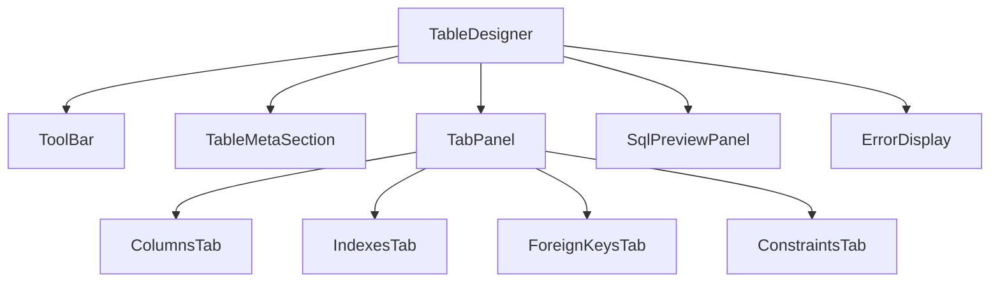

# 设计文档：表设计器重构（table-designer-redesign）

## 概述

本次重构将现有的两个独立组件（`table-designer-create.tsx` 和 `table-designer-edit.tsx`）合并为一个统一的 `TableDesigner` 组件，同时增加索引管理、完整约束管理（含编辑模式）、列注释、表注释、列名重命名、清除修改等功能。

设计参考 Antares SQL 客户端的交互模式，采用 Tab 面板切换列定义、索引、外键、约束等不同管理视图。

### 核心目标

- 统一新建/编辑两种模式为单一组件，通过 `mode` prop 区分
- 引入 `isChanged` 状态追踪未保存修改，支持"清除修改"一键还原
- 增强列定义：支持注释、精度/小数位、列复制、列排序
- 新增索引管理面板（CREATE/DROP INDEX）
- 统一外键管理（含 ON DELETE/ON UPDATE 动作选择）
- 统一唯一约束和检查约束管理（新建/编辑模式均支持）
- 完整的输入验证与错误处理

---

## 架构

### 整体架构

```
frontend/
  table-designer.tsx          ← 入口路由组件（保持接口兼容）
  table-designer-unified.tsx  ← 新的统一组件（核心实现）
  table-designer-shared.ts    ← 共享类型 + DDL 构建逻辑（扩展）
```

后端无需新增 API，复用现有接口：
- `postgres/columns` — 加载列定义
- `postgres/indexes` — 加载索引
- `postgres/foreign-keys` — 加载外键
- `postgres/unique-constraints` — 加载唯一约束
- `postgres/execute-ddl` — 执行 DDL 语句
- `postgres/data-types` — 获取数据类型列表

新增后端接口（需在 `api-core.ts` 中实现）：
- `postgres/table-comment` — 获取表注释
- `postgres/check-constraints` — 获取检查约束列表

### 状态管理架构

```
TableDesigner (SolidJS Store)
├── mode: "create" | "edit"
├── tableName: string
├── tableComment: string
├── columns: TableColumn[]        ← createStore
├── indexes: IndexDef[]           ← createStore
├── foreignKeys: ForeignKeyDef[]  ← createStore
├── uniqueConstraints: UniqueConstraintDef[]  ← createStore
├── checkConstraints: CheckConstraintDef[]    ← createStore
├── originalState: OriginalState  ← createSignal（快照，用于清除修改）
└── isChanged: boolean            ← createMemo（派生状态）
```

`isChanged` 通过比较当前状态与 `originalState` 快照派生，无需手动维护。

### 组件层次结构



---

## 组件与接口

### TableDesigner（主组件）

```typescript
interface TableDesignerProps {
  connectionId: string;
  connectionInfo: string;
  schema: string;
  table?: string;           // edit 模式必填
  mode: "create" | "edit";
  onSuccess?: (connectionId: string, schema: string) => void;
}
```

主组件负责：
1. 数据加载（edit 模式通过 `createResource` 并行加载列、索引、外键、约束、注释）
2. 维护所有 store 状态
3. 计算 `isChanged`（通过 `createMemo` 对比当前状态与原始快照的 JSON 序列化）
4. 协调保存、清除修改、验证等操作

### ToolBar

显示操作按钮：
- "保存"（`isChanged` 为 true 时高亮）
- "清除修改"（`isChanged` 为 false 时禁用）
- "预览 SQL"

### TableMetaSection

- edit 模式：只读显示 `schema.table_name`，可编辑表注释
- create 模式：可编辑表名输入框 + 表注释输入框

### ColumnsTab

列定义表格，列头：列名 | 类型 | 长度/精度 | 小数位 | 非空 | 主键 | 默认值 | 注释 | 操作（复制/上移/下移/删除）

- edit 模式下已有列的列名可编辑（支持重命名）
- 类型为 `numeric`/`decimal` 时显示精度+小数位，其他需要长度的类型显示长度

### IndexesTab

索引管理面板，每行：索引名 | 类型（BTREE/HASH）| 列（多选）| UNIQUE | 操作（删除）

- 已有索引标记来源（`isExisting: true`），删除时标记 `toDelete: true` 而非直接移除
- 新增索引 `isNew: true`

### ForeignKeysTab

外键管理面板，每行：约束名 | 本表列 | 参照 schema | 参照表 | 参照列 | ON DELETE | ON UPDATE | 操作

### ConstraintsTab

唯一约束 + 检查约束，分两个子区域：
- UNIQUE：约束名 | 列（逗号分隔）| 操作
- CHECK：约束名 | 表达式 | 操作

### SqlPreviewPanel

只读 `<pre>` 展示 `DDL_Builder` 生成的 SQL 列表，每条语句以 `;` 结尾并换行分隔。

---

## 数据模型

### 扩展后的 TableColumn

```typescript
interface TableColumn {
  name: string;
  originalName?: string;    // edit 模式：记录原始列名，用于生成 RENAME COLUMN
  dataType: string;
  length?: string;          // varchar/char 等
  precision?: string;       // numeric/decimal 精度
  scale?: string;           // numeric/decimal 小数位
  nullable: boolean;
  primaryKey: boolean;
  defaultValue: string;
  comment?: string;         // 列注释
  isNew?: boolean;          // true = 新增列（edit 模式）
}
```

### IndexDef

```typescript
interface IndexDef {
  name: string;
  indexType: "BTREE" | "HASH";
  columns: string[];        // 列名列表
  unique: boolean;
  isNew?: boolean;
  isExisting?: boolean;
  toDelete?: boolean;
}
```

### ForeignKeyDef

```typescript
interface ForeignKeyDef {
  constraintName?: string;
  column: string;
  refSchema: string;
  refTable: string;
  refColumn: string;
  onDelete: FKAction;
  onUpdate: FKAction;
  isNew?: boolean;
  isExisting?: boolean;
  toDelete?: boolean;
}

type FKAction = "NO ACTION" | "RESTRICT" | "CASCADE" | "SET NULL" | "SET DEFAULT";
```

### UniqueConstraintDef

```typescript
interface UniqueConstraintDef {
  constraintName?: string;
  columns: string;          // 逗号分隔的列名
  isNew?: boolean;
  isExisting?: boolean;
  toDelete?: boolean;
}
```

### CheckConstraintDef

```typescript
interface CheckConstraintDef {
  constraintName?: string;
  expression: string;
  isNew?: boolean;
  isExisting?: boolean;
  toDelete?: boolean;
}
```

### OriginalState（快照类型）

```typescript
interface OriginalState {
  tableName: string;
  tableComment: string;
  columns: TableColumn[];
  indexes: IndexDef[];
  foreignKeys: ForeignKeyDef[];
  uniqueConstraints: UniqueConstraintDef[];
  checkConstraints: CheckConstraintDef[];
}
```

### DDL_Builder 输出顺序

`buildDdlStatements()` 返回 `string[]`，按以下顺序生成：

1. `CREATE TABLE` / `ALTER TABLE ... ADD/ALTER/DROP COLUMN`
2. `ALTER TABLE ... RENAME COLUMN`
3. `ALTER TABLE ... DROP CONSTRAINT`（约束删除）
4. `ALTER TABLE ... ADD CONSTRAINT`（约束新增：UNIQUE、CHECK、FK）
5. `DROP INDEX`（索引删除）
6. `CREATE [UNIQUE] INDEX ... USING ...`（索引新增）
7. `COMMENT ON TABLE` / `COMMENT ON COLUMN`（注释语句）

### 新增后端 API

#### `postgres/table-comment`

请求：`{ connectionId, schema, table }`
响应：`{ comment: string | null }`

实现查询：
```sql
SELECT obj_description(
  ('"' || $1 || '"."' || $2 || '"')::regclass, 'pg_class'
) AS comment
```

#### `postgres/check-constraints`

请求：`{ connectionId, schema, table }`
响应：`{ constraints: Array<{ name: string; expression: string }> }`

实现查询：
```sql
SELECT cc.constraint_name AS name, cc.check_clause AS expression
FROM information_schema.check_constraints cc
JOIN information_schema.constraint_table_usage ctu
  ON cc.constraint_name = ctu.constraint_name
WHERE ctu.table_schema = $1 AND ctu.table_name = $2
  AND cc.constraint_name NOT LIKE '%_not_null'
```

---

## 正确性属性

*属性（Property）是在系统所有有效执行中都应成立的特征或行为——本质上是对系统应做什么的形式化陈述。属性是人类可读规范与机器可验证正确性保证之间的桥梁。*

### 属性 1：数据加载填充一致性

*对于任意* 表的列定义、索引、外键、唯一约束、检查约束和表注释数据，当 edit 模式加载完成后，组件内部状态中对应字段的值应与加载数据完全一致。

**验证：需求 1.2、5.3、7.4、8.4、9.3、9.4**

### 属性 2：修改触发 isChanged

*对于任意* 初始状态的 TableDesigner，当用户对列定义、索引、约束或表注释执行任意修改操作后，`isChanged` 应变为 `true`。

**验证：需求 2.2**

### 属性 3：清除修改还原（Round-Trip）

*对于任意* 修改操作序列（添加列、修改列、添加索引等），执行"清除修改"后，组件的所有状态（列、索引、约束、注释）应与执行修改前的原始快照完全一致，且 `isChanged` 应为 `false`。

**验证：需求 3.2、3.3**

### 属性 4：numeric/decimal 类型条件渲染

*对于任意* 列定义，当列类型为 `numeric` 或 `decimal` 时，应同时显示精度（precision）和小数位（scale）两个输入框；当列类型为其他需要长度的类型时，应显示长度（length）输入框；当列类型不需要长度时，两者均不显示。

**验证：需求 4.2**

### 属性 5：列注释 DDL 生成

*对于任意* 包含非空注释的列定义，`DDL_Builder` 生成的 SQL 列表中应包含对应的 `COMMENT ON COLUMN` 语句；当列注释为空时，不应生成该语句。

**验证：需求 4.3**

### 属性 6：列复制行为

*对于任意* 列定义，执行复制操作后，列列表长度应增加 1，新列的所有属性（除列名外）应与原列相同，新列名应为原列名加 `_copy` 后缀。

**验证：需求 4.4**

### 属性 7：列排序行为

*对于任意* 包含至少两列的列列表，对第 i 列执行"上移"操作后，该列应出现在第 i-1 位置，原第 i-1 列应出现在第 i 位置，其余列顺序不变；"下移"操作对称。

**验证：需求 4.5**

### 属性 8：表注释 DDL 生成

*对于任意* 非空表注释，`DDL_Builder` 生成的 SQL 列表中应包含 `COMMENT ON TABLE` 语句；当表注释为空时，不应生成该语句。

**验证：需求 5.2**

### 属性 9：列重命名 DDL 生成

*对于任意* 已有列（`isNew` 为 false），当列名被修改为不同的非空名称时，`DDL_Builder` 生成的 SQL 列表中应包含 `ALTER TABLE ... RENAME COLUMN old_name TO new_name` 语句，且 old_name 和 new_name 应正确对应。

**验证：需求 6.2**

### 属性 10：索引 DDL 生成

*对于任意* 新增索引定义（`isNew: true`），`DDL_Builder` 生成的 SQL 列表中应包含对应的 `CREATE [UNIQUE] INDEX ... ON ... USING ...` 语句；对于任意待删除的已有索引（`toDelete: true`），应包含对应的 `DROP INDEX` 语句。

**验证：需求 7.5、7.6**

### 属性 11：外键 DDL 生成

*对于任意* 新增外键定义（`isNew: true`），`DDL_Builder` 生成的 SQL 列表中应包含包含 `ON DELETE` 和 `ON UPDATE` 子句的 `ALTER TABLE ... ADD CONSTRAINT ... FOREIGN KEY` 语句；对于任意待删除的已有外键（`toDelete: true`），应包含对应的 `ALTER TABLE ... DROP CONSTRAINT` 语句。

**验证：需求 8.5、8.6**

### 属性 12：约束 DDL 生成

*对于任意* 新增唯一约束或检查约束，`DDL_Builder` 生成的 SQL 列表中应包含对应的 `ALTER TABLE ... ADD CONSTRAINT ... UNIQUE/CHECK` 语句；对于任意待删除的已有约束，应包含对应的 `ALTER TABLE ... DROP CONSTRAINT` 语句。

**验证：需求 9.5、9.6、9.7**

### 属性 13：DDL 生成顺序

*对于任意* 包含多种操作（列修改、列重命名、约束删除、约束新增、索引删除、索引新增、注释）的修改状态，`DDL_Builder` 生成的 SQL 列表中，列修改语句应出现在列重命名语句之前，约束删除语句应出现在约束新增语句之前，索引操作应出现在注释语句之前。

**验证：需求 10.2**

### 属性 14：无修改时 DDL 为空

*对于任意* 与原始状态完全相同的当前状态，`DDL_Builder` 生成的 SQL 列表应为空数组。

**验证：需求 10.5**

### 属性 15：重复列名验证

*对于任意* 包含两个或多个相同列名（大小写不敏感）的列列表，验证函数应返回"列名重复"错误，且保存操作应被阻止。

**验证：需求 11.3、6.4**

### 属性 16：自动生成索引名

*对于任意* 索引名为空的索引定义，当表名和列名均非空时，自动生成的索引名应符合 `idx_{表名}_{列名}` 格式，且不为空字符串。

**验证：需求 7.7**

---

## 错误处理

### 前端验证错误

在调用后端 API 之前，前端执行以下验证，任一失败则显示错误提示并阻止保存：

| 验证规则 | 错误提示 |
|---------|---------|
| 表名为空（create 模式） | "表名不能为空" |
| 存在列名为空的列 | "列名不能为空" |
| 存在重复列名 | "列名重复：{列名}" |
| 索引列列表为空 | "索引 {索引名} 的列不能为空" |
| 外键本表列/参照表/参照列为空 | "外键定义不完整" |
| 检查约束表达式为空 | "检查约束表达式不能为空" |

### 后端执行错误

- 逐条执行 DDL 语句，遇到错误立即停止
- 将后端返回的错误信息（`e.message`）显示在界面上
- 保持当前编辑状态不变（不重置为原始状态）
- 保存按钮恢复可用状态

### 加载错误

- edit 模式加载失败时，显示错误信息（通过 `createResource` 的 `error` 状态）
- 提供重试入口（重新触发 resource 加载）

---

## 测试策略

### 双重测试方法

本功能采用单元测试和属性测试相结合的方式：

- **单元测试**：验证具体示例、边界条件和错误处理
- **属性测试**：验证对所有输入都成立的通用属性

两者互补，共同提供全面的测试覆盖。

### 单元测试

重点覆盖：
- `DDL_Builder` 的各类 SQL 生成函数（具体示例验证）
- 验证函数（空表名、空列名、重复列名等边界条件）
- 加载错误处理（mock API 返回错误）
- 保存流程（mock API 成功/失败）
- UI 渲染测试（工具栏按钮、Tab 面板、输入框存在性）

### 属性测试

使用 **fast-check**（TypeScript 属性测试库）实现，每个属性测试运行最少 100 次迭代。

每个属性测试必须包含注释标记：
```
// Feature: table-designer-redesign, Property {N}: {属性描述}
```

**属性测试覆盖范围**（对应设计文档中的属性）：

| 测试 | 对应属性 | 测试方法 |
|-----|---------|---------|
| 修改触发 isChanged | 属性 2 | 生成随机修改操作，验证 isChanged=true |
| 清除修改还原 | 属性 3 | 生成随机修改序列，清除后对比快照 |
| 列注释 DDL 生成 | 属性 5 | 生成随机列定义（含/不含注释），验证 SQL 输出 |
| 列复制行为 | 属性 6 | 生成随机列，复制后验证属性 |
| 列排序行为 | 属性 7 | 生成随机列列表，上移/下移后验证顺序 |
| 表注释 DDL 生成 | 属性 8 | 生成随机表注释，验证 SQL 输出 |
| 列重命名 DDL 生成 | 属性 9 | 生成随机列名对，验证 RENAME COLUMN SQL |
| 索引 DDL 生成 | 属性 10 | 生成随机索引定义，验证 CREATE/DROP INDEX SQL |
| 外键 DDL 生成 | 属性 11 | 生成随机外键定义，验证 ADD/DROP CONSTRAINT SQL |
| 约束 DDL 生成 | 属性 12 | 生成随机约束定义，验证 ADD/DROP CONSTRAINT SQL |
| DDL 生成顺序 | 属性 13 | 生成包含多种操作的状态，验证 SQL 顺序 |
| 无修改时 DDL 为空 | 属性 14 | 生成任意原始状态，不修改时验证 SQL 为空 |
| 重复列名验证 | 属性 15 | 生成包含重复列名的列列表，验证验证函数 |
| 自动生成索引名 | 属性 16 | 生成随机表名和列名，验证自动索引名格式 |

### 测试文件结构

```
frontend/
  table-designer-shared.test.ts   ← DDL_Builder 单元测试 + 属性测试
  table-designer-unified.test.tsx ← 组件行为测试（使用 @solidjs/testing-library）
```

### 属性测试配置

```typescript
import fc from "fast-check";

// 最少 100 次迭代
fc.assert(fc.property(...), { numRuns: 100 });
```
